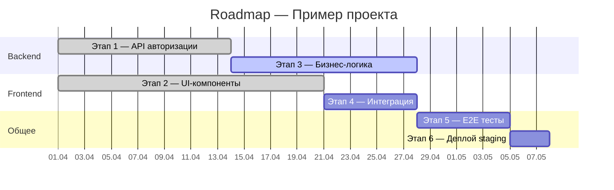

# Корпоративный стандарт AI-assisted разработки

**Статус:** Бета
**Версия:** 0.9
**Дата:** 2026-03-19
**Владелец:** Отдел по внедрению ИИ
**Разработчик:** Свиридов Алексей

---

## 1. Назначение и философия

Стандарт описывает обязательный процесс разработки продуктов с использованием ИИ-инструментов.

**Ключевая философия:**
> Мы применяем лучшие практики разработки, выработанные индустрией. ИИ выступает исполнителем — заменяет человека-кодера, но не заменяет инженерную культуру, архитектурное мышление и ответственность специалиста. Глубокая проработка документации, строгое тестирование и качество кода остаются фундаментом — независимо от того, кто пишет код: человек или ИИ.

**Область применения:**
- Все проекты компании (внедрение поэтапное — см. раздел 18)
- Все участники процесса разработки: разработчики, архитекторы, системные аналитики, бизнес-аналитики, QA, DevOps, саппорт
- Технологический стек не ограничен

---

## 2. Классификация проектов

Уровень проекта определяет список разрешённых ИИ-инструментов, обязательных правил безопасности и набор файлов из корпоративного хранилища.

| Уровень | Название | Данные | Разрешённые ИИ-инструменты |
|---------|---------|--------|---------------------------|
| **L1** | Public / Internal | Нет чувствительных данных, внутренние инструменты | Все одобренные инструменты |
| **L2** | Confidential | Корпоративная информация | Все одобренные инструменты |
| **L3** | Restricted | PII, финансовые данные, медицинские данные, коммерческая тайна, compliance-regulated | Только self-hosted LLM, развёрнутые внутри периметра компании |

> Уровень проекта определяется при инициализации и фиксируется в `AI_RULES.md` проекта.

---

## 3. Реестр ИИ-инструментов

### 3.1 Чат-инструменты

| Инструмент | Назначение | Уровни |
|------------|-----------|--------|
| Публичные LLM (ChatGPT, Claude, Gemini и др.) | Анализ, исследования, брейнсторминг, работа с документами | L1, L2 |
| Self-hosted LLM (Ollama, Llama, Mistral и др.) | Все задачи для restricted-проектов | L1, L2, L3 |

### 3.2 IDE и инструменты разработки

| Инструмент | Тип использования | Когда применять | Уровни |
|------------|------------------|-----------------|--------|
| **Верхнеуровневые оркестраторы** (Aperant, Paperclip и др.) | Автономная высокоуровневая разработка | **Обязателен для новых проектов.** Инициализация, roadmap, параллельные агентные задачи. Pipeline: Orchestrator → Coder → QA через изолированные git worktrees | L1, L2 |
| **IDE с ИИ** (Cursor, Windsurf и др.) | Точечная разработка с контекстом кодовой базы | Реализация фич, рефакторинг | L1, L2 |
| **CLI-агенты** (Claude Code, Codex и др.) | Точечная разработка, CLI-задачи | Выполнение задач из roadmap, code review, отладка | L1, L2 |
| **Self-hosted AI** | Все задачи | Для L3 проектов — self-hosted аналоги всех уровней | L1, L2, L3 |

### 3.3 Принцип выбора инструмента

```
Иерархия инструментов:

Уровень 1 — Оркестратор (Aperant, Paperclip и др.)
  └── Уровень 2 — IDE с ИИ (Cursor, Windsurf и др.)
        └── Уровень 3 — CLI-агент (Claude Code, Codex и др.)

Выбор точки входа:
Новый проект / масштабная задача / нужна автономия  →  Оркестратор (обязательно для новых проектов)
Точечная задача / нужен контекст файлов            →  IDE с ИИ / CLI-агент
Анализ / консультация / документация               →  Чат-инструменты (ChatGPT / Claude web)
Проект L3                                          →  только self-hosted аналоги всех уровней
```

---

## 4. Корпоративное хранилище AI-конфигураций

Все корпоративные skills, subagents, hooks и rules хранятся в **центральном репозитории** (`company-ai-toolkit`). Проекты импортируют нужные файлы при инициализации.

Подробная структура хранилища — см. **Приложение F**.

### 4.1 Принцип работы

```
company-ai-toolkit/                  ← корпоративный репозиторий
├── skills/                          ← переиспользуемые воркфлоу
├── agents/                          ← специализированные субагенты
├── hooks/                           ← детерминированная автоматизация
├── rules/                           ← правила по типам файлов
├── mcp/                             ← конфиги MCP по уровням
└── registry.md                      ← реестр: что обязательно, что опционально
```

### 4.2 Обязательность файлов

Каждый файл в хранилище помечен двумя атрибутами:

| Атрибут | Значения | Описание |
|---------|---------|---------|
| **Уровень проекта** | `L1`, `L2`, `L3`, `all` | При каком уровне файл обязателен |
| **Тип проекта** | `frontend`, `backend`, `fullstack`, `mobile`, `data`, `infra`, `all` | При каком типе проекта файл обязателен |

Пометки задаются в YAML-frontmatter каждого файла:

```yaml
---
required-for:
  levels: [all]
  types: [backend, fullstack]
---
```

### 4.3 Подключение и обновление в проекте

Хранилище подключается как **git submodule** в `.ai/toolkit`. Это обеспечивает версионирование и контролируемое обновление.

**При инициализации проекта:**
1. Определить уровень (L1/L2/L3) и тип проекта (frontend/backend/etc.)
2. Добавить submodule и зафиксировать на конкретном теге версии
3. Запустить `import.sh` — скрипт скопирует нужные файлы в `.ai/`
4. Зафиксировать в Git

**Обновление toolkit'а в проекте:**
- PATCH/MINOR — через автоматический MR от CI-бота (еженедельно)
- MAJOR — вручную с ревью команды

Хранилище использует SemVer. MAJOR-обновления обязательны, срок устанавливает отдел по внедрению ИИ.

Подробная инструкция — см. **Приложение F**.

---

## 5. Процесс разработки (AI-assisted SDLC)

**Ключевой принцип:**
> ИИ управляется документацией. Качество продукта прямо пропорционально качеству документации. Плохая документация → плохой продукт, независимо от качества ИИ.

Вся документация ведётся **синхронно в двух местах**:
- MD-файлы в репозитории проекта (используются ИИ-инструментами)
- Официальные документы в **корпоративной базе знаний** (Confluence, Notion, BookStack и др. — через MCP-интеграцию)

ИИ и специалист работают совместно с MCP — изменения в MD синхронизируются с базой знаний.

**Source of truth и синхронизация:**
- MD-файлы в git-репозитории — единственный источник истины
- База знаний **обязана** быть синхронна с git в любой момент времени
- Каждое изменение MD-файла должно синхронизироваться в базу знаний через MCP
- Расхождение между git и базой знаний — инцидент, который должен быть устранён
- При обнаружении расхождения — актуальной считается версия из git, база знаний перезаписывается

**Graceful degradation при недоступности базы знаний:**
- Недоступность базы знаний **не блокирует** работу — разработка продолжается по MD-файлам в git
- Неудавшаяся синхронизация фиксируется как задача с меткой `docs-sync` в трекере
- После восстановления доступа — пакетная синхронизация всех изменённых MD-файлов
- CI-задача проверяет расхождения еженедельно и создаёт алерт при обнаружении

**Структура процесса:**

| Тип | Фазы | Описание |
|-----|------|---------|
| **Основной цикл** | Фазы 1–4 | Последовательная цепочка: документация → roadmap → апрув → разработка. Применяется при создании нового проекта и при добавлении каждой новой фичи. |
| **Параллельные процессы** | Фазы 5–7 | Запускаются по событию: входящее обращение (5), обнаружение бага (6), решение о рефакторинге (7). Работают независимо от основного цикла. |

### Классификация задач по обязательности этапов

| Тип задачи | Описание | Обязательные этапы Фазы 1 | Пример |
|------------|---------|---------------------------|--------|
| **Бизнес-фича** | Новый функционал, влияющий на бизнес-логику | Все 6 этапов (BA → SA → Arch → QA → DevOps → Dev) | Новый модуль оплаты, интеграция с внешним сервисом |
| **Техническая задача** | Изменение, не влияющее на бизнес-функционал | Arch → Dev → QA | Рефакторинг, техдолг, обновление зависимостей, оптимизация |
| **Багфикс** | Исправление дефекта | QA → Dev (+ владельцы затронутых MD-файлов при необходимости) | См. Фаза 6 |

> **Принцип:** бизнес определяет что нужно — поэтому для любого функционала, затрагивающего бизнес-логику, прохождение всех ролей обязательно. Технические задачи, не меняющие поведение системы для пользователя, проходят укороченную цепочку.

Масштаб проработки пропорционален масштабу изменения.

**SLA на межролевые взаимодействия:**

| Действие | Срок |
|----------|------|
| Ответ на замечание к своему MD-файлу | 1 рабочий день |
| Апрув документации (Фаза 3) | 2 рабочих дня |
| Внесение правок после замечания | 2 рабочих дня |
| Эскалация при отсутствии ответа | Руководитель направления |

> SLA могут быть адаптированы под конкретный проект по согласованию с отделом по внедрению ИИ.

---

### 5.1 Владение документацией

**Принцип единственного владельца:** каждый MD-файл имеет одного владельца — специалиста соответствующей роли. Только владелец имеет право редактировать свой файл.

**Замещение:** у каждого владельца должен быть назначен заместитель — специалист той же или смежной роли, который берёт на себя ответственность в случае отсутствия владельца (отпуск, болезнь). Заместитель фиксируется в `docs/OWNERS.md`. При отсутствии владельца заместитель получает полные права на редактирование файлов.

| Владелец | Артефакты (файлы) | Права |
|----------|-------------------|-------|
| **Бизнес-аналитик** | `docs/business/requirements.md`, `docs/business/user-stories.md` | Единственный, кто создаёт и редактирует |
| **Системный аналитик** | `docs/sa/functional-requirements.md`, `docs/sa/non-functional-requirements.md`, `docs/sa/data-model.md` | Единственный, кто создаёт и редактирует |
| **Архитектор** | `docs/architecture/overview.md`, `docs/architecture/adr/*` | Единственный, кто создаёт и редактирует |
| **QA Lead** | `docs/qa/test-strategy.md`, `docs/qa/acceptance-criteria.md` | Единственный, кто создаёт и редактирует |
| **DevOps Lead** | `docs/devops/deployment.md`, `docs/devops/infrastructure.md` | Единственный, кто создаёт и редактирует |
| **Разработчик** | `docs/dev/technical-notes.md` | Единственный, кто создаёт и редактирует |

**Если другая роль обнаруживает проблему в чужом файле** — она создаёт замечание (issue в трекере / комментарий в базе знаний), но не редактирует файл напрямую. Владелец вносит изменения самостоятельно.

**Исключение:** Разработчик на этапе 1.6 может предлагать правки ко всем файлам, но каждая правка утверждается владельцем файла.

### 5.2 Совмещение ролей для малых команд

Для команд из 3–5 человек допускается совмещение ролей. Ниже — матрица допустимых совмещений.

**Принцип:** роли, которые проверяют друг друга, **не совмещаются** (writer ≠ reviewer).

| Роль | Может совмещать с | Не может совмещать с | Обоснование |
|------|-------------------|---------------------|-------------|
| **Бизнес-аналитик** | Системный аналитик | QA Lead | BA и SA работают последовательно на одних данных; BA + QA = конфликт интересов (сам пишет требования, сам принимает) |
| **Системный аналитик** | Бизнес-аналитик | Архитектор | SA + Arch: один человек и описывает требования, и принимает архитектурные решения — нет challenge |
| **Архитектор** | DevOps Lead | Системный аналитик | Arch + DevOps: оба работают на уровне инфраструктуры и технологий |
| **QA Lead** | — | BA, Developer | QA должен быть независим от автора требований и автора кода |
| **DevOps Lead** | Архитектор | — | DevOps + Arch — естественное совмещение |
| **Разработчик** | — | QA Lead | Writer ≠ Reviewer |

**Примеры минимальных команд:**

| Размер | Распределение |
|--------|--------------|
| **3 человека** | (1) BA + SA, (2) Arch + DevOps + Dev, (3) QA Lead |
| **4 человека** | (1) BA + SA, (2) Arch + DevOps, (3) Dev, (4) QA Lead |
| **5 человек** | (1) BA, (2) SA, (3) Arch + DevOps, (4) Dev, (5) QA Lead |

> **QA Lead не совмещается** ни с кем в минимальных конфигурациях — это сознательное решение. Независимость QA от разработки и от авторов требований — фундамент качества.

---

### Фаза 1 — Проработка документации через диалог с ИИ

**Применяется:** при создании нового проекта и при добавлении новой фичи.

**Формат работы:** специалист ведёт интервью-диалог с ИИ в соответствующей роли. ИИ задаёт уточняющие вопросы, специалист отвечает. Результат каждого диалога — создание или обновление MD-файлов. За качество MD-файла отвечает специалист-владелец.

Каждый этап завершается проверкой и передачей на следующий этап. Шаблоны промптов для каждой роли — см. **Приложение B**.

#### Новый проект vs. Новая фича

| Аспект | Новый проект | Новая фича |
|--------|-------------|-----------|
| Артефакты | Создаются с нуля | Обновляются существующие файлы |
| Масштаб проработки | Полный | Пропорционален масштабу фичи |
| Цепочка ролей | Все 6 этапов обязательны | По классификации задач (см. выше) |
| ROADMAP | Создаётся новый | Обновляется — добавляется этап |
| Документация | Новые MD-файлы | Новые секции или дочерние файлы |

#### 1.1 Бизнес-аналитик + ИИ
**Владелец:** Бизнес-аналитик
**Артефакты:** `docs/business/requirements.md`, `docs/business/user-stories.md`
**Фокус:**
- Какую проблему решает продукт / фича?
- Кто целевые пользователи и их сценарии?
- Критерии успеха, границы MVP / scope фичи

#### 1.2 Системный аналитик + ИИ
**Владелец:** Системный аналитик
**Артефакты:** `docs/sa/functional-requirements.md`, `docs/sa/non-functional-requirements.md`, `docs/sa/data-model.md`
**Фокус:**
- Системные интеграции
- Требования к производительности, безопасности, масштабируемости
- Ограничения и зависимости

#### 1.3 Архитектор + ИИ
**Владелец:** Архитектор
**Артефакты:** `docs/architecture/overview.md`, `docs/architecture/adr/`
**Фокус:**
- Архитектура и технический стек (для фичи — влияние на существующую архитектуру)
- Architecture Decision Records (ADR) с обоснованием trade-offs
- Архитектурные риски

#### 1.4 QA Lead + ИИ
**Владелец:** QA Lead
**Артефакты:** `docs/qa/test-strategy.md`, `docs/qa/acceptance-criteria.md`
**Фокус:**
- Стратегия тестирования (для фичи — дополнение существующей)
- Критерии приёмки для каждого требования
- Приоритеты тестирования

#### 1.5 DevOps Lead + ИИ
**Владелец:** DevOps Lead
**Артефакты:** `docs/devops/deployment.md`, `docs/devops/infrastructure.md`
**Фокус:**
- CI/CD стратегия (для фичи — влияние на существующий pipeline)
- Окружения (dev / staging / prod)
- Мониторинг и алертинг

#### 1.6 Разработчик + ИИ
**Владелец:** Разработчик (для `docs/dev/technical-notes.md`)
**Артефакты:** финальная версия всех MD-файлов, `docs/dev/technical-notes.md`
**Фокус:**
- Реализуемость в рамках выбранного стека
- Выявление противоречий между требованиями разных ролей
- Предложение правок во все MD-файлы → **каждая правка утверждается владельцем файла**

---

### Фаза 2 — Построение / обновление Roadmap

После завершения документации — построение или обновление roadmap с помощью оркестратора (Aperant, Paperclip и др.) или CLI-агента (Claude Code и др.) на основе готовых MD-файлов.

- **Новый проект:** создаётся `ROADMAP.md` с разбивкой на этапы, задачи и критерии готовности каждого этапа.
- **Новая фича:** обновляется `ROADMAP.md` — добавляется новый этап с задачами и критериями готовности.

#### Выбор формата Roadmap

| Масштаб проекта | Формат | Когда использовать |
|----------------|--------|-------------------|
| **Малый** (до 1 месяца разработки) | Плоский список этапов | Проект с линейной последовательностью задач, 1–3 разработчика |
| **Средний и крупный** (более 1 месяца) | Структурированный с зависимостями и диаграммой Ганта | Параллельные потоки работ, несколько команд, сложные зависимости |

#### Шаблон ROADMAP.md — малый проект

```markdown
# Roadmap — [название проекта]

**Последнее обновление:** YYYY-MM-DD
**Статус:** In Progress / Completed

## Этап 1 — [название]
**Срок:** YYYY-MM-DD → YYYY-MM-DD
**Статус:** ✅ Done / 🔄 In Progress / ⏳ Pending

Задачи:
- [ ] Задача 1.1 — краткое описание
- [ ] Задача 1.2 — краткое описание
- [ ] Задача 1.3 — краткое описание

Критерии готовности:
- [ ] Все тесты проходят
- [ ] Code review пройден
- [ ] Merge в dev выполнен

## Этап 2 — [название]
...
```

#### Шаблон ROADMAP.md — средний и крупный проект
```markdown
# Roadmap — [название проекта]
**Последнее обновление:** YYYY-MM-DD
**Статус:** In Progress / Completed
**Команда:** [количество человек, ключевые роли]

## Обзор этапов
| # | Этап | Срок | Зависит от | Ответственный | Статус |
|---|------|------|-----------|---------------|--------|
| 1 | [название] | W1–W2 | — | @developer1 | ✅ Done |
| 2 | [название] | W1–W3 | — | @developer2 | 🔄 In Progress |
| 3 | [название] | W3–W4 | Этап 1, Этап 2 | @developer1 | ⏳ Blocked |
| 4 | [название] | W4–W5 | Этап 3 | @developer2 | ⏳ Pending |

## Диаграмма Ганта
[mermaid-диаграмма — см. пример ниже за пределами шаблона]

## Детализация этапов

### Этап 1 — [название]
**Срок:** YYYY-MM-DD → YYYY-MM-DD
**Зависит от:** —
**Блокирует:** Этап 3
**Ответственный:** @developer1
**Статус:** ✅ Done

Задачи:
- [x] Задача 1.1 — краткое описание
- [x] Задача 1.2 — краткое описание
- [x] Задача 1.3 — краткое описание

Критерии готовности:
- [x] Все тесты проходят
- [x] Code review пройден
- [x] Merge в dev выполнен
- [x] API задокументирован

### Этап 2 — [название]

## Риски и зависимости
| Риск | Вероятность | Влияние | Митигация |
|------|------------|---------|-----------|
| [описание] | Высокая / Средняя / Низкая | [какие этапы затронуты] | [план действий] |

## История изменений
| Дата | Изменение | Причина |
|------|----------|---------|
| YYYY-MM-DD | Добавлен этап N | Новая фича [название] |
```

**Пример mermaid-диаграммы Ганта** (вставляется в секцию «Диаграмма Ганта» шаблона выше):



> **Mermaid** отображается в GitHub, GitLab и большинстве IDE. Если инструмент не поддерживает mermaid — диаграмма остаётся как текстовое описание зависимостей в таблице «Обзор этапов».

---

### Фаза 3 — Апрув-ревью документации

Обязательный апрув перед стартом разработки. Чеклист ревью — см. **Приложение C**.

#### 3.1 Верификация AI-сгенерированной документации

Документация, созданная в диалоге с ИИ на Фазе 1, проходит автоматическую проверку в git pipeline перед апрув-ревью:

```
1. Кросс-валидация     → AI в свежей сессии проверяет непротиворечивость всех MD-файлов между собой
2. Проверка полноты    → AI проверяет наличие всех обязательных секций по шаблону
3. Проверка фактов     → Флаг конкретных утверждений, которые требуют подтверждения человеком
                         (числовые метрики, SLA, ограничения, названия систем)
4. Отчёт               → Формируется отчёт верификации, прикрепляется к MR
```

> **Принцип Writer/Reviewer:** верификация выполняется ИИ в отдельной сессии, не той, в которой документация создавалась. Свежий контекст обеспечивает объективность. Промпт верификатора — см. **Приложение B (AI-верификатор документации)**.

#### 3.2 Апрув-ревью людьми

| Роль | Что проверяет |
|------|--------------|
| Архитектор | Архитектурные решения, технический стек, ADR |
| Разработчик | Реализуемость, полнота технических требований |
| QA | Полнота критериев приёмки, тестируемость требований |

**Разработка стартует только при Approved от всех трёх ролей.**

---

### Фаза 4 — Разработка и ревью

1. Выбрать инструмент согласно разделу 3.3
2. Импортировать обязательные файлы из корпоративного хранилища (раздел 4)
3. Подключить обязательные MCP-серверы — см. **Приложение D**
4. Вести разработку по этапам `ROADMAP.md` строго по TDD
5. Перед каждой значимой задачей — **Plan Mode**: Explore → Plan → Implement → Verify

**Обязательный workflow каждой задачи:**
```
1. Plan Mode (read-only)   → исследовать код, составить план
2. Утверждение плана       → разработчик проверяет план
3. TDD                     → тесты → реализация → рефакторинг
4. Verify                  → прогон тестов, проверка результата
```

**После завершения каждого этапа Roadmap** — обязательный MR pipeline:

```
1. AI code review          → автоматические замечания (Writer/Reviewer: свежая сессия)
2. Автоисправление         → ИИ устраняет замечания
3. Прогон тестов           → все тесты должны пройти
4. Ревью человека          → финальное утверждение разработчиком
5. Merge в dev ветку
6. Обновление статуса в ROADMAP.md
```

**Writer/Reviewer паттерн:** AI code review выполняется в **отдельной сессии** от сессии разработки. Свежий контекст обеспечивает объективность — ИИ не предвзят к коду, который сам написал.

**CI/CD интеграция:** AI code review может быть автоматизирован в pipeline MR через CLI-агент ИИ в non-interactive режиме (см. **Приложение G**).

MR без пройденных тестов не принимается к ревью человеком.

---

### Фаза 5 — Саппорт и входящие обращения

Саппорт — точка входа для внешних обращений от клиентов и пользователей.

**Процесс:**

```
Клиент сообщает о проблеме
        │
        ▼
Саппорт описывает проблему и создаёт issue в трекере
        │
        ▼
Саппорт определяет критичность
        │
        ├── CRITICAL (production down, блокер)
        │         │
        │         ▼
        │   Issue сразу передаётся Разработчику
        │   (ускоренный процесс, см. Фаза 6 → Hotfix)
        │
        └── NORMAL (не блокирует работу)
                  │
                  ▼
            Issue передаётся QA
                  │
                  ▼
            QA анализирует и маршрутизирует
            (далее по процессу Фазы 6)
```

**Требования к issue от саппорта:**
- Шаги воспроизведения
- Ожидаемое поведение
- Фактическое поведение
- Окружение (браузер, версия, ОС)
- Критичность: CRITICAL / NORMAL
- Скриншоты / логи при наличии

Шаблон промпта для саппорта — см. **Приложение B (Support)**. Жизненный цикл задачи в трекере — см. **раздел 12**.

---

### Фаза 6 — Процесс исправления багов

Баг может быть обнаружен на любом этапе: в dev, staging или production. Процесс багфикса отличается от процесса новой фичи тем, что инициатором является QA, а не BA.

**Принцип:** баг может быть симптомом ошибки в коде, а может быть следствием ошибки в требованиях, архитектуре или acceptance criteria. QA определяет корневую причину и маршрутизирует исправление.

#### Схема процесса

```
QA обнаруживает баг
        │
        ▼
QA анализирует: нужна ли правка MD-файлов?
        │
        ├── ДА → определяет какие файлы затронуты
        │         │
        │         ▼
        │   Отправляет замечание владельцу файла
        │         │
        │         ▼
        │   Владелец вносит правки в свой MD-файл (с ИИ)
        │         │
        │         ▼
        │   Передача по цепочке: SA → Arch → QA → DevOps → Dev
        │   (только затронутые роли, не обязательно все)
        │         │
        │         ▼
        │   Апрув-ревью изменённых файлов
        │         │
        │         ▼
        │   Разработчик фиксит баг по TDD
        │
        ├── НЕТ → передаёт на Разработчика напрямую
        │         │
        │         ▼
        │   Разработчик анализирует баг
        │         │
        │         ├── Обнаруживает что нужна правка MD → возврат к владельцу файла
        │         │
        │         └── Правка не нужна → фиксит по TDD
        │
        ▼
  MR pipeline (AI review → автоисправление → тесты → ревью человека → merge)
```

#### Правила

1. **QA — точка входа.** Все баги фиксируются QA в трекере с описанием: шаги воспроизведения, ожидаемое поведение, фактическое поведение.

2. **QA определяет маршрут.** QA анализирует совместно с ИИ:
   - Баг в реализации (код не соответствует требованиям) → передать Разработчику
   - Баг в требованиях (требования неполны или ошибочны) → передать владельцу соответствующего MD-файла
   - Баг в acceptance criteria (критерии не покрывают кейс) → QA исправляет свой файл самостоятельно

3. **Правка MD только владельцем.** Если баг вызван ошибкой в `docs/sa/`, только Системный аналитик вносит правки. Никто другой не редактирует чужие файлы.

4. **Частичная цепочка.** При багфиксе не обязательно проходить все 6 ролей. Цепочка начинается с роли-владельца затронутого файла и идёт до Разработчика, затрагивая только тех, чьи файлы нуждаются в обновлении.

5. **Разработчик может эскалировать.** Если в процессе исправления разработчик обнаруживает, что баг глубже чем казалось и требует правки MD-файлов — он создаёт замечание владельцу файла. Работа приостанавливается до внесения правок.

6. **TDD для багфиксов обязателен.** Сначала — failing тест, воспроизводящий баг. Затем — исправление. Затем — рефакторинг.

7. **MR pipeline без изменений.** Багфикс проходит тот же MR pipeline что и любой код: AI review → автоисправление → тесты → ревью человека.

#### Hotfix (CRITICAL)

Для критических проблем (production down) — ускоренный процесс:

1. Issue от саппорта попадает **напрямую к Разработчику**, минуя QA-анализ
2. Разработчик фиксит по TDD: failing тест → fix → refactor
3. MR pipeline обязателен (без исключений)
4. Ветка: `hotfix/*` → merge в `main` и `dev`
5. **После деплоя** — обязательный ретроспективный проход:
   - QA проверяет: нужна ли правка acceptance criteria?
   - Если баг выявил пробел в документации — цепочка ролей запускается постфактум

> Hotfix не освобождает от документации. Он лишь позволяет сначала починить production, а потом обновить MD-файлы.

---

### Фаза 7 — Рефакторинг и технический долг

Плановый рефакторинг инициируется Разработчиком или Архитектором.

**Процесс:**

```
Разработчик / Архитектор создаёт issue с обоснованием рефакторинга
        │
        ▼
Архитектор + ИИ — оценка влияния на архитектуру
(если рефакторинг затрагивает архитектуру — обновление ADR)
        │
        ▼
Разработчик выполняет рефакторинг по TDD
        │
        ▼
QA — проверка что рефакторинг не сломал существующие тесты
        │
        ▼
MR pipeline (AI review → тесты → ревью человека → merge)
```

**Правила:**
- Цепочка ролей для рефакторинга: **Архитектор → Разработчик → QA**
- BA, SA, DevOps привлекаются только если рефакторинг затрагивает их артефакты
- Рефакторинг не должен менять поведение системы — только внутреннюю структуру
- Все существующие тесты должны пройти без изменений (кроме случаев изменения интерфейсов)

---

## 6. Адаптация legacy-проектов

Legacy-проекты адаптируются к стандарту **поэтапно**.

### Этап 1 — Немедленно

- Подключить обязательные MCP-серверы (Приложение D)
- Вставить обязательный блок правил в `AI_RULES.md` (Приложение A)
- Подключить хранилище как git submodule и импортировать обязательные skills, agents, hooks (Приложение F)
- Использовать ИИ-инструменты в повседневной разработке

### Этап 2 — В течение первого квартала

- Создать структуру `docs/` и начать заполнение MD-файлов
- Каждая новая фича и каждый багфикс проходят по полному процессу (Фазы 1–4 стандарта)
- Постепенно накапливается документация, покрывающая существующую функциональность

### Этап 3 — Полная интеграция

- Все MD-файлы заполнены для ключевой функциональности
- Проект полностью работает по стандарту
- Оркестратор (Aperant, Paperclip и др.) используется для крупных задач

> Темп адаптации определяет команда проекта совместно с отделом по внедрению ИИ. Главное — **каждое новое изменение уже идёт по стандарту**, ретроспективная документация заполняется параллельно.

---

## 7. Git Flow


Обязательная стратегия ветвления для всех проектов:

```
main          ← production releases only
└── release/* ← release candidates
└── dev        ← основная ветка разработки
    └── feature/*  ← новая функциональность
    └── fix/*      ← исправления
    └── hotfix/*   ← срочные исправления в main
```

---

## 8. Тестирование

### 8.1 Обязательные уровни тестирования

| Тип | Обязателен | Исключения |
|-----|-----------|-----------|
| Unit | Да | - |
| Integration | Да | - |
| E2E | Да | - |
| Performance / Load | Да | - |
| Security (SAST/DAST) | Да | - |

### 8.2 Покрытие

- **Минимум 80%** для всего кода
- **CRUD-операции** — исключение из порогового требования

### 8.3 TDD — обязательный паттерн

**Все новые функции и исправления пишутся строго по циклу Red → Green → Refactor.**

```
Цикл:
1. Написать failing тест на основе acceptance criteria (Red)
2. Написать минимальную реализацию для прохождения теста (Green)
3. Провести рефакторинг не ломая тесты (Refactor)
```

**Порядок работы с ИИ по TDD:**
1. Передать ИИ acceptance criteria из `docs/qa/acceptance-criteria.md`
2. Попросить написать тесты → убедиться что тесты падают (Red)
3. Попросить написать минимальную реализацию (Green)
4. Провести рефакторинг совместно с ИИ (Refactor)

PR без тестов для новой функциональности отклоняется без ревью.

---

## 9. Управление контекстом ИИ

Контекстное окно — ключевой ресурс. При его заполнении качество ИИ деградирует.

### 9.1 Обязательные правила

- `/clear` между несвязанными задачами — сброс контекста
- Субагенты для исследования кодовой базы — не засорять основной контекст
- После 2 неудачных коррекций — `/clear` и новый промпт с учётом ошибок
- `AI_RULES.md` до 200 строк. Детали выносить в `@imports` и `.ai/rules/`
- Использовать MCP-серверы для точечных данных вместо сырого вывода: навигация по коду, документация библиотек, git-диффы, интеграция с трекером и базой знаний

### 9.2 Антипаттерны

| Антипаттерн | Симптом | Решение |
|-------------|---------|---------|
| Kitchen sink session | Несвязанные задачи в одной сессии | `/clear` между задачами |
| Бесконечная коррекция | 3+ исправлений одной ошибки | `/clear` + новый промпт |
| Раздутый AI_RULES.md | ИИ игнорирует правила | Сократить, вынести в rules/skills |
| Trust-then-verify gap | Код выглядит хорошо, но не работает | Всегда давать верификацию: тесты, скриншоты |
| Бесконечное исследование | ИИ читает сотни файлов | Ограничить scope или использовать субагентов |

---

## 10. Обязательные правила проекта

Каждый проект должен содержать:
- **`AI_RULES.md`** — обязательный блок корпоративных правил (см. **Приложение A**) + правила специфичные для проекта. Максимум 200 строк, детали через `@imports`.
- **`.mcp.json`** — конфигурация MCP-серверов по уровню проекта (см. **Приложение D**)
- **`.ai/skills/`** — обязательные skills из корпоративного хранилища (см. **Приложение F**)
- **`.ai/agents/`** — обязательные субагенты из корпоративного хранилища (см. **Приложение F**)
- **`.ai/settings.json`** — обязательные hooks (см. **Приложение F**)
- **`.ai/rules/`** — правила по типам файлов из корпоративного хранилища (см. **Приложение F**)

> **Маппинг на конкретные инструменты:** `AI_RULES.md` транслируется в формат конкретного инструмента при инициализации проекта (например, `CLAUDE.md` для Claude Code, `.cursorrules` для Cursor). Директория `.ai/` аналогично маппится на `.claude/`, `.cursor/` и др. Скрипт `import.sh` выполняет трансляцию автоматически.

Для проектов **L3 (Restricted)** дополнительно применяются расширенные правила безопасности:

```markdown
## Security Rules — L3 Restricted
- ONLY use self-hosted LLM within company perimeter
- Never send any project data to external AI services
- SAST scan must pass before any MR is accepted
- Report any discovered vulnerability immediately, before proceeding
```

Полный перечень политик безопасности — см. **Приложение E**.

---

## 11. Обязательная структура проекта

```
project-root/
├── AI_RULES.md                      # Правила для ИИ (≤200 строк, @imports для деталей)
├── ROADMAP.md                       # Дорожная карта разработки
├── .mcp.json                        # Конфиг MCP-серверов (Приложение D)
├── .ai/
│   ├── settings.json                # Hooks и permissions
│   ├── skills/
│   │   ├── fix-issue/SKILL.md       # Воркфлоу: issue → fix → test → PR
│   │   ├── security-review/SKILL.md # Воркфлоу: security-ревью кода
│   │   └── code-review/SKILL.md     # Воркфлоу: code review по чеклисту
│   ├── agents/
│   │   ├── security-reviewer.md     # Субагент: проверка безопасности
│   │   └── code-reviewer.md         # Субагент: проверка качества кода
│   └── rules/
│       ├── security.md              # Правила безопасности (все файлы)
│       ├── tests.md                 # Правила тестирования (*.test.*)
│       └── api.md                   # Правила API (src/api/**)
├── docs/
│   ├── business/
│   │   ├── requirements.md
│   │   └── user-stories.md
│   ├── sa/
│   │   ├── functional-requirements.md
│   │   ├── non-functional-requirements.md
│   │   └── data-model.md
│   ├── architecture/
│   │   ├── overview.md
│   │   └── adr/
│   ├── qa/
│   │   ├── test-strategy.md
│   │   └── acceptance-criteria.md
│   ├── dev/
│   │   └── technical-notes.md
│   └── devops/
│       ├── deployment.md
│       └── infrastructure.md
```

---

## 12. Жизненный цикл задачи (Issue Lifecycle)

Все задачи, баги и фичи отслеживаются в **трекере задач** (Jira, Linear, YouTrack и др.). Обязательные статусы:

| Статус | Описание |
|--------|---------|
| **Open** | Задача зафиксирована, ещё не взята в работу |
| **In Analysis** | QA или разработчик анализирует задачу, маршрутизирует |
| **In Documentation** | Обновление MD-файлов владельцем роли |
| **Awaiting Approval** | Документация отправлена на апрув-ревью (Фаза 3) |
| **In Progress** | Разработка идёт по TDD |
| **In Review** | MR создан, проходит AI review + ревью человека |
| **Done** | Merge выполнен, задача закрыта |
| **Blocked** | Задача заблокирована — зависимость или ожидание решения |

**Правила:**
- Каждый переход статуса сопровождается комментарием в трекере с обоснованием
- Статус **Blocked** требует указания блокера в комментарии
- Баги от саппорта создаются с меткой `bug` и приоритетом `CRITICAL` / `NORMAL`
- Hotfix-задачи создаются с меткой `hotfix` и автоматически получают приоритет `CRITICAL`
- После деплоя hotfix разработчик закрывает задачу и создаёт новую задачу с меткой `docs-debt` если нужна ретроспективная документация

---

## 13. Метрики

Обязательные метрики для всех проектов. Сбор и анализ — ответственность отдела по внедрению ИИ.

**Инструмент сбора:** трекер задач (основной источник данных для метрик процесса и качества).

| Категория | Метрика | Источник | Целевой диапазон |
|-----------|--------|---------|-----------------|
| **Скорость** | Время от создания задачи до статуса Done | Трекер: cycle time | 1–5 дней (задача), 1–3 недели (фича). Отслеживать тренд — снижение на 10–20% за квартал |
| **Скорость** | Время от идеи до первого рабочего билда | Трекер: epic lead time | Зависит от масштаба. Фиксировать baseline на пилоте, далее отслеживать тренд |
| **Качество** | Количество багов в production (метки `bug` + `production`) | Трекер: фильтр | Снижение на 15–30% за квартал относительно baseline. CRITICAL-баги: стремиться к 0 |
| **Качество** | Покрытие тестами (цель: ≥80% кроме CRUD) | CI/CD отчёт | ≥80%. Для критичных модулей (auth, платежи) — ≥90% |
| **Экономика** | Стоимость токенов / затраты на ИИ-инструменты на проект | AI tool dashboard | В рамках установленного месячного лимита (раздел 14.1). Стоимость на задачу — отслеживать тренд |
| **Процесс** | % MR прошедших без замечаний человека после AI-ревью | Appendix G метрики | 40–60% на старте, целевой рост до 70–80% за 2–3 квартала |
| **Процесс** | Среднее количество итераций до Approved | Трекер: комментарии на ревью | 1–3 итерации. Более 3 — сигнал о проблемах в документации или понимании задачи |
| **Документация** | % проектов с полным набором MD-файлов перед стартом | Трекер: фильтр по статусу Awaiting Approval | 100% для новых проектов. Legacy — рост на 20–30% за квартал до полного покрытия |

> **Целевые диапазоны** — рекомендуемые ориентиры. Конкретные значения уточняются по результатам пилота (раздел 18, этап 1) и фиксируются для каждого проекта индивидуально. Baseline замеряется в первый месяц, далее отслеживается тренд.

---

## 14. Оптимизация затрат на ИИ

### 14.1 Мониторинг и алерты

- Каждый проект отслеживает расход токенов через AI tool dashboard
- **Алерты** настраиваются на уровне проекта:
  - Предупреждение при достижении 70% от месячного лимита
  - Блокирующий алерт при достижении 90% — эскалация на руководителя проекта
- Месячный лимит устанавливается отделом по внедрению ИИ совместно с руководителем проекта при инициализации

### 14.2 Рекомендации по оптимизации

| Рекомендация | Описание | Экономия |
|-------------|---------|---------|
| **Единый RAG для проектов** | Корпоративный RAG-сервис, индексирующий кодовые базы и документацию проектов. Обеспечивает быстрый поиск контекста без передачи больших файлов в контекст ИИ | Высокая — сокращение input-токенов на 30–60% |
| **Выбор модели по задаче** | Использовать наиболее мощную модель только для сложных задач (архитектура, security review). Для рутинных задач (линтинг, форматирование, простые фиксы) — менее дорогую модель | Средняя — до 50% на рутинных задачах |
| **Кеширование контекста** | Использовать prompt caching (где поддерживается провайдером) для повторяющихся системных промптов и правил | Средняя — сокращение стоимости system prompt |
| **Субагенты вместо основного контекста** | Исследование кодовой базы через субагентов с меньшей моделью — основной агент получает только результат | Средняя |
| **MCP вместо сырых данных** | MCP-серверы возвращают точечные данные вместо полных файлов (git diff вместо git log, навигация вместо чтения целых файлов) | Средняя — меньше input-токенов |
| **Своевременный /clear** | Сброс контекста между несвязанными задачами предотвращает деградацию качества и перерасход | Низкая, но предотвращает waste |

### 14.3 Задачи, где ИИ неэффективен

Не все задачи оправдывают использование ИИ. Избегать использования ИИ для:
- Простые механические правки (переименование, перенос файлов)
- Задачи, требующие доступа к закрытым внутренним системам без MCP
- Задачи, где контекст превышает возможности окна и невозможно декомпозировать

---

## 15. Политика подготовки рабочих мест

Все сотрудники компании получают рабочее оборудование с **предустановленными и преднастроенными** ИИ-инструментами.

**Принцип:** сотрудник получает рабочее место и сразу начинает работать с ИИ — все инструменты, модели, правила, skills, MCP-серверы уже настроены и готовы к использованию.

**Степень свободы зависит от категории сотрудника:**
- **Нетехнические сотрудники** (менеджеры, HR, маркетинг и др.) — получают полностью готовое рабочее место без необходимости настройки. Конфигурация AI-инструментов требует глубоких познаний в ОС и инструментах разработки, которыми эти сотрудники не обязаны владеть.
- **Технические специалисты SDLC** (разработчики, архитекторы, DevOps, QA) — получают преднастроенное рабочее место как стартовую точку, но имеют свободу в настройке и кастомизации в рамках одобренного реестра инструментов. Глубокое понимание конфигурации ИИ-инструментов — часть их профессиональной компетенции.

**Разделение ответственности:**

| Роль | Ответственность |
|------|----------------|
| **Отдел по внедрению ИИ** | Формирует реестр одобренных инструментов, моделей и конфигураций. Определяет состав профилей рабочих мест. Обновляет конфигурации при выходе новых версий инструментов и правил |
| **IT-отдел** | Подготовка образов, установка и настройка инструментов на оборудование. Поддержка и обновление установленного ПО |

### 15.1 Профили рабочих мест

Каждый сотрудник получает профиль в зависимости от категории и уровня проектов, к которым он имеет доступ.

#### Категории сотрудников

| Категория | Кто входит | Предустанавливаемые инструменты | Кастомизация |
|-----------|-----------|--------------------------------|-------------|
| **SDLC — разработка** | Разработчики, Архитекторы, DevOps | Чат-инструменты + IDE с ИИ + CLI-агенты | Свободная в рамках одобренного реестра |
| **SDLC — аналитика и QA** | BA, SA, QA Lead | Чат-инструменты + IDE с ИИ | Свободная в рамках одобренного реестра |
| **SDLC — саппорт** | Support-специалисты | Чат-инструменты + IDE с ИИ | Минимальная — по запросу |
| **Офисные сотрудники** | Менеджеры, HR, маркетинг и др. | Чат-инструменты + IDE с ИИ | Не предусмотрена |

> **IDE с ИИ** предустанавливается всем категориям, включая офисных сотрудников — для возможности создания микропрограмм, дашбордов, отчётов и автоматизации рабочих задач.

#### Что входит в преднастройку

| Компонент | Описание |
|-----------|---------|
| **Одобренные LLM** | Настроенные подключения к одобренным моделям (API-ключи, endpoints) |
| **IDE с ИИ** | Установленная и настроенная IDE с подключённой моделью |
| **CLI-агенты** | Установленные CLI-инструменты с корпоративными настройками (только для категории «SDLC — разработка») |
| **MCP-серверы** | Преднастроенный `.mcp.json` по уровню проекта (Приложение D) |
| **Skills** | Обязательные skills из корпоративного хранилища (Приложение F) |
| **Rules** | Обязательные правила из корпоративного хранилища (Приложение F) |
| **Hooks** | Обязательные hooks из корпоративного хранилища (Приложение F) |
| **Subagents** | Обязательные субагенты из корпоративного хранилища (Приложение F) |
| **Библиотека промптов** | Для нетехнических сотрудников — база готовых промптов для типовых задач (раздел 16) |

### 15.2 Дифференциация по уровням проектов

| Аспект | L1 — Public | L2 — Confidential | L3 — Restricted |
|--------|------------|-------------------|----------------|
| **Модели** | Все одобренные (облачные) | Все одобренные (облачные) | Только self-hosted модели внутри периметра |
| **IDE с ИИ** | Одобренные IDE, облачные модели | Одобренные IDE, облачные модели | Одобренные IDE, подключённые к self-hosted моделям |
| **CLI-агенты** | Одобренные CLI, облачные API | Одобренные CLI, облачные API | Одобренные CLI, self-hosted endpoints |
| **MCP-серверы** | Полный набор (Приложение D, L1) | Расширенный набор с БД (Приложение D, L2) | Только self-hosted серверы (Приложение D, L3) |
| **Кастомизация** | Допускается в рамках одобренного реестра | Допускается в рамках одобренного реестра | **Запрещена** без согласования с отделом внедрения ИИ и службой безопасности |

> **L3:** конфигурация рабочего места строго фиксирована. Любое изменение настроек, добавление инструментов или моделей требует письменного согласования с отделом по внедрению ИИ и службой информационной безопасности.

### 15.3 Запрет самостоятельной установки

- **Запрещено** устанавливать AI-инструменты, не входящие в одобренный реестр (раздел 3)
- **Запрещено** подключать модели или API-endpoints, не одобренные отделом по внедрению ИИ
- **Запрещено** отключать или модифицировать предустановленные корпоративные rules, hooks и skills
- На одобренных инструментах действуют корпоративные правила и фильтры — использование неодобренных инструментов обходит эти защитные механизмы
- Нарушение данного пункта для проектов **L2 и L3** является инцидентом безопасности (см. Приложение E)

> Сотрудник может предложить новый инструмент через процесс, описанный в разделе 17.3.

### 15.4 Обновление рабочих мест

- Отдел по внедрению ИИ публикует обновлённые конфигурации при каждом релизе `company-ai-toolkit` (см. Приложение F)
- IT-отдел применяет обновления централизованно через систему управления конфигурациями
- **MAJOR-обновления** инструментов сопровождаются уведомлением сотрудников и, при необходимости, кратким обучением
- Для L3 — обновления проходят дополнительное согласование со службой безопасности перед развёртыванием

---

## 16. Онбординг

**Предусловие:** рабочее место сотрудника подготовлено согласно разделу 15 — все ИИ-инструменты предустановлены и преднастроены до начала онбординга.

Обязательные элементы для каждого нового сотрудника и при переходе на новый проект:

1. **Рабочее место** — ИИ-инструменты установлены, настроены и готовы к использованию (раздел 15)
2. **Документ** — изучение данного стандарта
3. **Курс** — обязательный обучающий курс по ИИ-инструментам (предоставляется отделом по внедрению ИИ)
4. **Библиотека промптов** — доступ к корпоративной базе готовых промптов для типовых рабочих задач (особенно важно для нетехнических сотрудников)
5. **Ментор** — закреплённый ментор на период онбординга

**Библиотека промптов для нетехнических сотрудников:**
Отдел по внедрению ИИ поддерживает корпоративную базу промптов — готовые шаблоны для типовых задач (создание отчётов, анализ данных, подготовка презентаций, автоматизация рутинных процессов и др.). Библиотека доступна в корпоративной базе знаний и предустанавливается на рабочие места офисных сотрудников. SDLC-роли используют специализированные промпты из Приложения B.

**Владелец стандарта и онбординга:** отдел по внедрению ИИ.
**Актуализация стандарта:** по мере появления значимых изменений в инструментах или процессах.

---

## 17. Исследование и внедрение новых инструментов

AI-инструменты развиваются стремительно. Стандарт должен эволюционировать вместе с экосистемой.

**Ответственность:** отдел по внедрению ИИ.

### 17.1 Регулярный ресёрч

- **Ежемесячно:** мониторинг новых AI-инструментов, обновлений существующих, публикаций и бенчмарков
- **Ежеквартально:** отчёт с рекомендациями — какие инструменты добавить / убрать / заменить в реестре
- Результаты публикуются в корпоративной базе знаний в разделе «AI Tools Research»

### 17.2 Процесс добавления нового инструмента

```
1. Отдел внедрения ИИ идентифицирует кандидата
2. Оценка по критериям: безопасность (Приложение E), стоимость, качество, интеграция
3. Пилот на 1–2 проектах (2–4 недели)
4. Сбор обратной связи и метрик
5. Решение: добавить в реестр / отклонить / продолжить пилот
6. При добавлении — обновление стандарта, toolkit и онбординг-материалов
```

### 17.3 Инициатива от команд

Любой сотрудник может предложить новый инструмент через:
- Issue в трекере с меткой `ai-tool-proposal`
- Описание инструмента, use case и ожидаемый эффект
- Отдел внедрения ИИ рассматривает предложение в рамках ежемесячного ресёрча

---

## 18. Этапы внедрения стандарта

Стандарт внедряется **поэтапно**, не одномоментно для всей компании.

### Этап 1 — Пилот (1–2 месяца)

- Выбрать 2–3 проекта разного масштаба и типа (новый проект, legacy, разные стеки)
- Внедрить стандарт полностью на пилотных проектах
- Назначить ответственного из отдела внедрения ИИ на каждый пилот
- Еженедельный сбор обратной связи от команд
- Фиксация метрик до и после внедрения

**Критерии успеха пилота:**
- Команды способны следовать процессу без постоянной помощи
- Нет блокирующих проблем в процессе
- Метрики качества не ухудшились, метрики скорости не деградировали критично

### Этап 2 — Коррекция (2–4 недели)

- Анализ обратной связи и метрик пилота
- Корректировка стандарта по результатам
- Обновление toolkit, промптов, чеклистов
- Публикация версии 1.0 стандарта

### Этап 3 — Масштабирование (поквартально)

- Каждый квартал подключать 30–50% оставшихся проектов
- Приоритет: новые проекты → активные проекты → legacy в поддержке
- Для каждой волны — краткий онбординг от отдела внедрения ИИ
- Сбор метрик и коррекция стандарта по итогам каждой волны

### Этап 4 — Полное покрытие

- Все проекты компании работают по стандарту
- Переход к режиму непрерывного улучшения (раздел 17)

> Конкретные сроки этапов определяются отделом по внедрению ИИ совместно с руководством. Указанные выше — рекомендуемые.

---

## Приложения

- **[Приложение A](appendix-a-mandatory-rules.md)** — Обязательный блок правил для `AI_RULES.md` проекта
- **[Приложение B](appendix-b-role-prompts.md)** — Шаблоны промптов по ролям (BA / SA / Arch / QA / DevOps / Dev / Support)
- **[Приложение C](appendix-c-approval-checklist.md)** — Чеклист апрув-ревью документации
- **[Приложение D](appendix-d-mcp-configs.md)** — Шаблоны `.mcp.json` по уровням проекта
- **[Приложение E](appendix-e-security-policies.md)** — Политики безопасности и compliance *(placeholder — заполняется отделом безопасности)*
- **[Приложение F](appendix-f-toolkit-repository.md)** — Корпоративное хранилище AI-конфигураций (skills, agents, hooks, rules)
- **[Приложение G](appendix-g-ci-cd-ai-review.md)** — CI/CD интеграция AI code review
